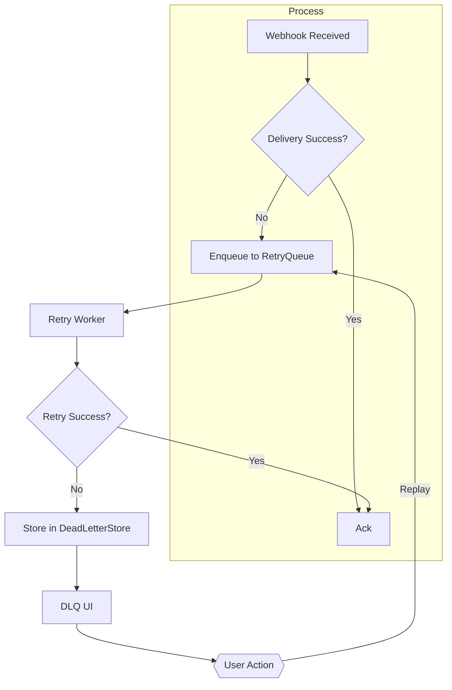

# Webhook Durability Guide

## Overview

Durable webhook delivery is essential for reliable event-driven systems. This guide explains the retry and dead‑letter mechanisms provided by **M4** and shows how to use the concrete implementations:
- `RetryQueue`
- `RedisRetryQueue`
- `SqsRetryQueue`
- `DeadLetterStore`

It also demonstrates how to inspect and replay dead‑lettered events and compares in‑process vs durable retries.

---

## 1. RetryQueue Interface

```go
type RetryQueue interface {
    // Enqueue puts a webhook payload onto the queue for later retry.
    Enqueue(ctx context.Context, payload WebhookPayload) error

    // Dequeue fetches the next payload that should be retried. It blocks until a payload is available or the context is cancelled.
    Dequeue(ctx context.Context) (WebhookPayload, error)

    // Ack acknowledges successful processing of a payload.
    Ack(ctx context.Context, id string) error

    // Nack registers a failure; the payload will be retried according to the implementation’s policy.
    Nack(ctx context.Context, id string, err error) error
}
```

`RetryQueue` abstracts the retry storage and policy. Implementations differ in durability and scaling characteristics.

---

## 2. RedisRetryQueue

### 2.1 How it works
- Uses a Redis **sorted set** keyed by `<queue>:retry` where the score is the **next retry timestamp**.
- When a payload fails, `Nack` adds the payload with a back‑off schedule (exponential by default).
- A background worker calls `Dequeue` which runs a `ZRANGEBYSCORE` query for items whose timestamp ≤ `now`.
- Successful processing triggers `Ack`, which removes the item from the set.

### 2.2 End‑to‑end example
```go
// Initialize the queue
rdb := redis.NewClient(&redis.Options{Addr: "localhost:6379"})
queue := redisqueue.NewRedisRetryQueue(rdb, "webhook", redisqueue.WithBackoff(redisqueue.ExponentialBackoff(5*time.Second)))

// Enqueue a webhook
payload := webhook.WebhookPayload{ID: "msg-123", URL: "https://example.com/hook", Body: []byte(`{"event":"order.created"}`)}
if err := queue.Enqueue(context.Background(), payload); err != nil { log.Fatalf("enqueue failed: %v", err) }

// Worker loop
for {
    msg, err := queue.Dequeue(context.Background())
    if err != nil { log.Printf("dequeue error: %v", err); continue }
    if err := sendWebhook(msg); err != nil {
        // Register failure – it will be retried according to back‑off
        _ = queue.Nack(context.Background(), msg.ID, err)
        continue
    }
    _ = queue.Ack(context.Background(), msg.ID)
}
```

> **Tip** – Run the worker as a separate process or a container; Redis guarantees durability across restarts.

---

## 3. SqsRetryQueue

- Stores each retry attempt as an **SQS message** in a dedicated retry queue.
- Visibility timeout controls the back‑off; after the timeout expires the message becomes visible again.
- `Nack` re‑queues the message with an increased delay using `ChangeMessageVisibility`.
- `Ack` deletes the message.

**When to use** – High‑throughput cloud‑native environments where AWS SQS is already part of the stack.

---

## 4. DeadLetterStore Interface

```go
type DeadLetterStore interface {
    // Store persists a failed payload together with the error and retry attempts.
    Store(ctx context.Context, payload WebhookPayload, err error) error

    // List returns the IDs of all dead‑lettered messages.
    List(ctx context.Context) ([]string, error)

    // Get retrieves a specific dead‑letter entry.
    Get(ctx context.Context, id string) (DeadLetterEntry, error)

    // Replay moves a dead‑letter entry back onto a RetryQueue for another attempt.
    Replay(ctx context.Context, id string, target RetryQueue) error
}
```

M4 ships a **RedisDeadLetterStore** and an **S3DeadLetterStore** implementation. Both expose a simple REST endpoint for UI inspection.

---

## 5. DLQ Inspection & Replay Flow

1. **Inspect** – UI or CLI calls `DeadLetterStore.List` → displays IDs and basic metadata.
2. **View details** – `DeadLetterStore.Get(id)` returns payload, error, and attempt count.
3. **Replay** – User selects a message and clicks *Replay* → `DeadLetterStore.Replay(id, retryQueue)` moves it back to the appropriate `RetryQueue`.
4. **Monitor** – After replay, the message appears in the normal processing flow and can be `Ack`‑ed or `Nack`‑ed again.

The following diagram visualises the flow:



---

## 6. What Happens on Process Restart?

| Scenario                     | In‑process retries (no durable queue) | Durable retries (`RedisRetryQueue` / `SqsRetryQueue`) |
|------------------------------|---------------------------------------|--------------------------------------------------|
| Process crashes while handling a webhook | All pending retries are **lost** – the payload is never retried. | Pending retries remain in Redis/SQS; the worker can resume after restart. |
| Worker restarts after a back‑off period | No knowledge of which payloads need another attempt. | The queue automatically yields the next due payload based on the stored timestamp or visibility timeout. |
| Dead‑lettered payloads | No persistent storage – information is gone. | Stored in `DeadLetterStore`; can be inspected and replayed later. |

---

## 7. Full Redis Example (End‑to‑End)

1. **Deploy Redis** – `docker run -p 6379:6379 redis:7-alpine`
2. **Configure the queue** – See the code snippet in section 2.2.
3. **Run the worker** – `go run ./cmd/webhook-worker`
4. **Trigger a webhook** – POST to the service; on failure, the payload is enqueued.
5. **Inspect DLQ** – `GET /admin/dlq` (provided by the admin UI) lists failed events.
6. **Replay** – Click *Replay* next to an entry; the worker will attempt delivery again.

---

## 8. Next Steps

- Add unit tests for each implementation (`RedisRetryQueue`, `SqsRetryQueue`, `RedisDeadLetterStore`).
- Extend the admin UI to filter DLQ entries by error type.
- Document monitoring metrics (retry count, DLQ size, replay success rate).

---

*This guide is live under `apps/web/content/guides/webhook-durability.md`.*
